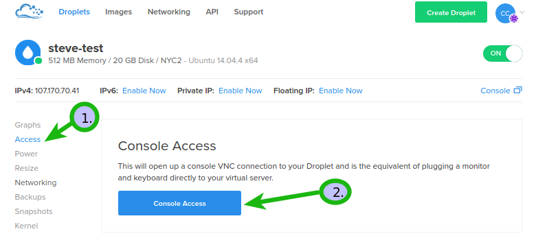

# Problem with SSH after enabling UFW

<h3> Since you've configured your firewall the following error should be new to you.</h3>

<pre><code>ssh: connect to host 159.203.92.33 port 22: Connection timed out</code></pre> :flushed:

# Here's a good aproach

Add the rule by using the`1.` Web Console in the `2.`access option
{:class="img-responsive"}

<h3>now you will get few prompts like the following:</h3>
<pre>droplet-name login:root</pre>
you should use your `root` account which it's the one that's having a full control of your server.

Then you will be asked for your password and that should be the same exact password which you were using when you wanted log in into your server with ssh .

<h3>Thereafter you can type your command as the following:</h3>

<input type="checkbox" class="sidebar-checkbox" id="sidebar-checkbox">
`sudo ufw allow ssh`

<h3>You can then add more rules via the web console whenever you like but reasonably with purpose ...</h3>
